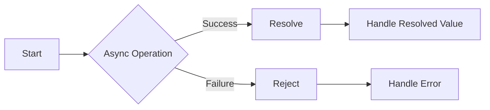

# Asynchronous

- Governs how we perform tasks which take some time to complete
- e.g. get data from Database

> start now; finish later;

**Synchronous code:**

- Run statement at a time.

**callback function defination:**

- a function that is _passed as an argument to another function, and it gets executed later, usually after some asynchronous operation_ or event occurs.

## Http requests:

- make http requests to get data from another server
- we make these requests to API endpoints

Below is a table describing HTTP requests and responses and their types:

| Type         | Description                                                                                                                              |
| ------------ | ---------------------------------------------------------------------------------------------------------------------------------------- |
| **Request**  |                                                                                                                                          |
| GET          | Requests data from a specified resource.                                                                                                 |
| POST         | Submits data to be processed to a specified resource.                                                                                    |
| PUT          | Updates a specified resource with new data.                                                                                              |
| DELETE       | Deletes a specified resource.                                                                                                            |
| HEAD         | Requests the headers of a specified resource. It's similar to GET but only retrieves headers without the actual content.                 |
| PATCH        | Partially updates a resource with new data.                                                                                              |
| OPTIONS      | Requests information about the communication options available for the target resource.                                                  |
| CONNECT      | Establishes a tunnel to the server identified by the target resource.                                                                    |
| TRACE        | Performs a message loop-back test along the path to the target resource, providing a useful debugging mechanism.                         |
| **Response** |                                                                                                                                          |
| 1xx          | Informational responses indicating that the request was received and understood but processing is still ongoing.                         |
| 2xx          | Success responses indicating that the request was received, understood, and processed successfully.                                      |
| 3xx          | Redirection responses indicating that further action is needed to complete the request, typically to redirect the client to another URL. |
| 4xx          | Client error responses indicating that the client's request contains incorrect syntax or cannot be fulfilled.                            |
| 5xx          | Server error responses indicating that the server failed to fulfill an apparently valid request due to an unexpected condition.          |

- HTTP requests are initiated by clients (such as web browsers) to request resources from a server, while HTTP responses are sent by servers to provide clients with requested resources or inform them about the outcome of their requests.
- The type of request or response corresponds to the action being performed or the status of the request or response.

#### XMLHttpRequest

- XMLHttpRequest is an API provided by web browsers that enables client-side JavaScript code to make HTTP requests to servers.
- It allows you to fetch data from a server or send data to a server asynchronously without needing to reload the entire web page.
- XMLHttpRequest was the **traditional method** for making asynchronous requests in web applications before _modern alternatives like the fetch API and libraries like Axios became more prevalent_.

**Example:**

```js
var xhr = new XMLHttpRequest(); // Create a new XMLHttpRequest object

xhr.open("GET", "https://api.example.com/data", true); // Specify the HTTP method and URL

xhr.onreadystatechange = function () {
  // Define a callback function to handle the response
  if (xhr.readyState === XMLHttpRequest.DONE) {
    // Check if the request is complete
    if (xhr.status === 200) {
      // Check if the request was successful
      console.log(xhr.responseText); // Print the response data
    } else {
      console.error("Request failed: " + xhr.status); // Print an error message
    }
  }
};

xhr.send(); // Send the request
```

#### Callback hell

- Callback hell is a term used to describe the situation in JavaScript where multiple nested callback functions create code that is hard to read, understand, and maintain.
- This often happens when dealing with asynchronous operations, such as making HTTP requests or reading files, where one operation depends on the result of another.
- The deep nesting of callbacks can lead to what looks like a "**pyramid**" of code, making it difficult to follow the flow of execution and debug errors.

Here's an example of callback hell:

```javascript
asyncOperation1(function (result1) {
  // First asynchronous operation completes
  asyncOperation2(result1, function (result2) {
    // Second asynchronous operation completes
    asyncOperation3(result2, function (result3) {
      // Third asynchronous operation completes
      asyncOperation4(result3, function (result4) {
        // Fourth asynchronous operation completes
        // And so on...
      });
    });
  });
});
```

- In this example, each asynchronous operation is dependent on the result of the previous one, leading to deep nesting of callback functions.
- As more operations are added, the code becomes increasingly difficult to manage, understand, and modify.

> Callback hell can also be exacerbated by error handling.

- If each operation requires error handling, the code can become even more convoluted with nested try-catch blocks or if-else statements within each callback.

Here's an example with error handling added:

```javascript
asyncOperation1(function (result1, error1) {
  if (error1) {
    console.error("Error in asyncOperation1:", error1);
    return;
  }
  asyncOperation2(result1, function (result2, error2) {
    if (error2) {
      console.error("Error in asyncOperation2:", error2);
      return;
    }
    asyncOperation3(result2, function (result3, error3) {
      if (error3) {
        console.error("Error in asyncOperation3:", error3);
        return;
      }
      asyncOperation4(result3, function (result4, error4) {
        if (error4) {
          console.error("Error in asyncOperation4:", error4);
          return;
        }
        // And so on...
      });
    });
  });
});
```

- As you can see, error handling adds even more indentation and complexity to the code, making it harder to maintain.

- To mitigate callback hell, various techniques have been developed, _such as using named functions, modularization, promises, async/await, and libraries like `async.js`_.
- These techniques aim to make asynchronous code more readable, maintainable, and less prone to callback hell.
- Promises and async/await are particularly effective in flattening the code structure and improving its readability.

# Promises

Promises in JavaScript are objects used to represent the eventual completion (or failure) of an asynchronous operation, and its resulting value. They help in handling asynchronous operations more easily, especially when dealing with multiple asynchronous tasks.

Here's a simple explanation:

1. **Creating a Promise**: You create a promise using the `new Promise()` constructor, which takes a function as an argument. This function, called the executor, takes two parameters: `resolve` and `reject`. Inside this function, you perform your asynchronous operation, and then call `resolve()` when it's successful, or `reject()` if it fails.

2. **Handling the Promise**: You use `.then()` method to handle the resolved value, and `.catch()` method to handle any errors that occur during the execution of the promise.

Here's an example:

```javascript
// Creating a promise
const myPromise = new Promise((resolve, reject) => {
  // Simulating an asynchronous operation
  setTimeout(() => {
    const randomNum = Math.random();
    if (randomNum < 0.5) {
      resolve("Success!"); // Resolve the promise with a success message
    } else {
      reject("Error!"); // Reject the promise with an error message
    }
  }, 1000);
});

// Handling the promise
myPromise
  .then((result) => {
    console.log("Resolved:", result); // Handle the resolved value
  })
  .catch((error) => {
    console.error("Rejected:", error); // Handle any errors
  });
```

Now, let's create a simple Mermaid diagram to visualize the flow of the promise:



In this diagram:

- `Start` represents the beginning of the promise.
- `Async Operation` represents the asynchronous operation being performed.
- If the operation is successful (`Success`), the promise resolves (`Resolve`), and the resolved value is handled (`Handle Resolved Value`).
- If the operation fails (`Failure`), the promise rejects (`Reject`), and the error is handled (`Handle Error`).

This simple Mermaid diagram illustrates the flow of a promise, from its creation to its resolution or rejection, and how the resolved value or error is handled.

##### Check this analogy to understand better

> Imagine you want to get a surprise gift from your parents.

- You ask them, _"Can I have a surprise gift?"_ Now, your parents might say, "Sure! But we need to go to the store first, and it might take some time."

Here's how this relates to promises in JavaScript:

1. **Asking for a Promise**:

- When you ask for the surprise gift, it's like creating a promise in JavaScript.
- You're asking for something, but you know it might not be available right away.

2. **Going to the Store**:

- This is like the asynchronous operation in JavaScript.
- Your parents need to go to the store to get the gift, which takes some time.
- Similarly, in JavaScript, you might be waiting for data to be fetched from a server or for some other asynchronous task to be completed.

3. **Receiving the Surprise Gift**:

- When your parents come back from the store, they might bring the surprise gift if everything went well.
- This is like the promise being **resolved** in JavaScript. You get what you asked for, and you're happy!

4. **Not Getting the Surprise Gift**:

- Sometimes, things might not go as planned.
- Maybe the store ran out of the gift you wanted, or your parents forgot to buy it.
- In this case, you don't get the surprise gift, and you might feel disappointed.
- This is similar to the promise being rejected in JavaScript.
- Something went wrong during the asynchronous operation, and you need to handle that error.

So, in JavaScript, a promise is like asking for something and being told you'll get it later. You can then decide what to do when you finally get the thing you asked for, or if something goes wrong and you don't get it.

#### `Promise.all()`

- `Promise.all()` is used to wait for all promises to resolve successfully.
- It takes an array of promises as input and returns a single promise that resolves with an array of resolved values from each promise.
- If any promise in the array fails, the entire `Promise.all()` call fails immediately.

```javascript
// Example promises
const promise1 = new Promise((resolve, reject) => {
  setTimeout(() => {
    resolve("Promise 1 resolved");
  }, 1000);
});

const promise2 = new Promise((resolve, reject) => {
  setTimeout(() => {
    resolve("Promise 2 resolved");
  }, 2000);
});

const promise3 = new Promise((resolve, reject) => {
  setTimeout(() => {
    resolve("Promise 3 resolved");
  }, 3000);
});

// Using Promise.all() to handle multiple promises
Promise.all([promise1, promise2, promise3])
  .then((results) => {
    console.log("All promises resolved:", results);
  })
  .catch((error) => {
    console.error("One or more promises failed:", error);
  });
```

#### `Promise.allSettled()`

- `Promise.allSettled()` is used to wait for all promises to settle, regardless of whether they succeed or fail.
- It takes an array of promises as input and returns a single promise that resolves with an array of objects containing the outcome of each promise.
- This allows you to handle each promise's outcome individually, regardless of success or failure.

```javascript
// Example promises
const promise1 = new Promise((resolve, reject) => {
  setTimeout(() => {
    resolve("Promise 1 resolved");
  }, 1000);
});

const promise2 = new Promise((resolve, reject) => {
  setTimeout(() => {
    reject("Promise 2 rejected");
  }, 2000);
});

const promise3 = new Promise((resolve, reject) => {
  setTimeout(() => {
    resolve("Promise 3 resolved");
  }, 3000);
});

// Using Promise.allSettled() to handle multiple promises
Promise.allSettled([promise1, promise2, promise3]).then((results) => {
  console.log("All promises settled:", results);
});
```

- `Promise.resolve()`: Returns a resolved promise with the provided value.
- `Promise.reject()`: Returns a rejected promise with the provided reason.

#### `Promise.race()`

- `Promise.race()` is used to return a promise that resolves or rejects as soon as one of the promises in the iterable resolves or rejects.
- It takes an array of promises as input and returns a single promise.
- The result of the first settled promise (whether resolved or rejected) is passed to the `.then()` or `.catch()` method accordingly.

```javascript
// Example promises
const promise1 = new Promise((resolve, reject) => {
  setTimeout(() => {
    resolve("Promise 1 resolved");
  }, 1000);
});

const promise2 = new Promise((resolve, reject) => {
  setTimeout(() => {
    resolve("Promise 2 resolved");
  }, 2000);
});

const promise3 = new Promise((resolve, reject) => {
  setTimeout(() => {
    resolve("Promise 3 resolved");
  }, 3000);
});

// Using Promise.race() to handle multiple promises
Promise.race([promise1, promise2, promise3])
  .then((result) => {
    console.log("First promise to settle:", result);
  })
  .catch((error) => {
    console.error("One or more promises failed:", error);
  });
```

#### `Promise.any()`

- `Promise.any()` is used to return a promise that resolves as soon as any of the promises in the iterable resolves, or rejects if all of the promises reject.
- It takes an array of promises as input and returns a single promise.
- The result of the first resolved promise is passed to the `.then()` method, while if all promises are rejected, the `.catch()` method is called with an `AggregateError` containing all rejection reasons.

```javascript
// Example promises
const promise1 = new Promise((resolve, reject) => {
  setTimeout(() => {
    reject("Promise 1 rejected");
  }, 1000);
});

const promise2 = new Promise((resolve, reject) => {
  setTimeout(() => {
    resolve("Promise 2 resolved");
  }, 2000);
});

const promise3 = new Promise((resolve, reject) => {
  setTimeout(() => {
    resolve("Promise 3 resolved");
  }, 3000);
});

// Using Promise.any() to handle multiple promises
Promise.any([promise1, promise2, promise3])
  .then((result) => {
    console.log("First promise to resolve:", result);
  })
  .catch((error) => {
    console.error("All promises rejected:", error);
  });
```

# Fetch API

- a modern interface for fetching resources (such as JSON data, HTML files, images, etc.) across the network.
- It provides a more powerful and flexible way to make HTTP requests in JavaScript compared to older methods like XMLHttpRequest.

- Fetch API is **built into JavaScript environments**, it can be used in both browser-based applications and server-side environments like Node.js, making it a versatile and widely-supported tool for fetching resources across the network.

> With the Fetch API, you can send HTTP requests to servers and handle the responses using promises. It allows you to fetch data asynchronously without blocking the execution of your code.

### Example:

Here's a simple example of how to use the Fetch API to fetch JSON data from an API endpoint:

```javascript
// Fetching JSON data from an API endpoint
fetch("https://api.example.com/data")
  .then((response) => {
    // Check if the response is successful (status code 200-299)
    if (!response.ok) {
      throw new Error("Network response was not ok");
    }
    // Parse the JSON data, which also returns a promise.
    return response.json();
  })
  .then((data) => {
    // Handle the JSON data
    console.log("Fetched data:", data);
  })
  .catch((error) => {
    // Handle any errors that occurred during the fetch operation
    console.error("Fetch error:", error);
  });
```

The Fetch API provides a simple and concise way to make HTTP requests and handle responses in JavaScript. It's widely supported in modern browsers and is the recommended approach for performing AJAX requests.

**AJAX request**

<details>
  <summary> <b>Click to view the answer.</b> </summary>

- AJAX (Asynchronous JavaScript and XML) is a technique used in web development to send and receive data from a server asynchronously **without requiring a full page refresh**.
- It allows web pages to update content dynamically, making them more interactive and responsive to user actions.

- With AJAX, you can make HTTP requests from a web page to a server in the background, fetch data from the server, and update parts of the page with the retrieved data without reloading the entire page.
- This enables the development of web applications that feel more like desktop applications, as they can update content seamlessly without interrupting the user's experience.

- The term "XML" in AJAX is historical and refers to the fact that XML was often used as the data format for communication between the client and server. However, nowadays, JSON (JavaScript Object Notation) is more commonly used due to its simplicity and ease of parsing in JavaScript.

> In summary, AJAX allows web pages to communicate with a server in the background, fetch data, and update content dynamically without requiring a full page reload, resulting in a smoother and more interactive user experience.

</details>

# Async and Await

Async/await is a feature introduced in ECMAScript 2017 (ES8) that provides a more concise and readable way to work with asynchronous code in JavaScript. It allows you to write asynchronous code in a synchronous style, making it easier to understand and maintain.

### Simple Explanation:

- `async`: The `async` keyword is used to define asynchronous functions. Functions marked with `async` always return a promise, even if they don't explicitly do so.
- `await`: The `await` keyword is used to pause the execution of an asynchronous function until a promise is settled (resolved or rejected). It can only be used inside an `async` function.

### Example:

Here's an example of how to use `async` and `await` to fetch data from an API asynchronously:

```javascript
// Asynchronous function to fetch data from an API
async function fetchData() {
  try {
    // Send HTTP request using fetch() and wait for response (object)
    const response = await fetch("https://api.example.com/data");

    // Check if response is successful
    if (!response.ok) {
      throw new Error("Network response was not ok");
    }

    // Parse JSON data from response and return it
    const data = await response.json();
    return data;
  } catch (error) {
    // Handle any errors that occur during fetch operation
    console.error("Fetch error:", error);
    // Return undefined or throw error based on application logic
    return undefined;
  }
}

// Call the asynchronous function and handle the result
async function processData() {
  try {
    // Wait for fetchData() to complete and get the data
    const data = await fetchData();

    // Process the fetched data
    console.log("Fetched data:", data);
  } catch (error) {
    // Handle any errors that occur during data processing
    console.error("Data processing error:", error);
  }
}

// Call processData() to start fetching and processing data
processData();
```

In this example:

- The `fetchData()` function is marked as `async`, making it an asynchronous function. It fetches data from an API using the Fetch API and returns the parsed JSON data.
- Inside `fetchData()`, `await` is used to pause the execution until the fetch operation is complete and the response is available.
- The `processData()` function is also marked as `async`, and it calls `fetchData()` to fetch the data asynchronously. It then processes the fetched data.
- Both `fetchData()` and `processData()` functions use `try...catch` blocks to handle any errors that may occur during asynchronous operations.

Async/await simplifies asynchronous code by allowing you to write it in a more sequential and synchronous style, making it easier to understand and maintain.
